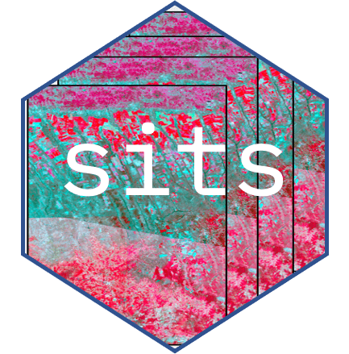

# sits-gee example



<!-- badges: start -->
<!-- badges: end -->

Side-by-side examples of the sits and Google Earth Engine APIs.

## Getting started

To get started with the examples in this repository, first clone the
repository:

``` sh
git clone https://github.com/e-sensing/sitsgee-example.git
```

Next, open the `sitsgee-example` directory in the RStudio and install
the examples package:

``` r
devtools::install(".")
```

If you want to use the development version of the
[sits](https://github.com/e-sensing/sits) R package to run the examples,
you can install it using [devtools](https://devtools.r-lib.org/):

``` r
devtools::install_github("e-sensing/sits@dev")
```

Now, you can run the examples! Happy analyzing with
[sits](https://github.com/e-sensing/sits) and
[GEE](https://earthengine.google.com/)!

## Repository structure

- `data/`: Includes datasets used in the examples.
- `scripts/`: Scripts for preprocessing data and running examples.
- `examples/`: Reproducible examples demonstrating the same operations
  in `sits` and `GEE`.

## Contributing

Contributions are welcome! If you have an example that you’d like to
share, please submit a pull request. Make sure your example is
well-documented and includes all necessary data and scripts.

## License

This repository is licensed under the Creative Commons CC0 License. See
the `LICENSE` file for more details.

## Contact

For questions or suggestions, please open an issue or contact the
repository maintainers.

------------------------------------------------------------------------
